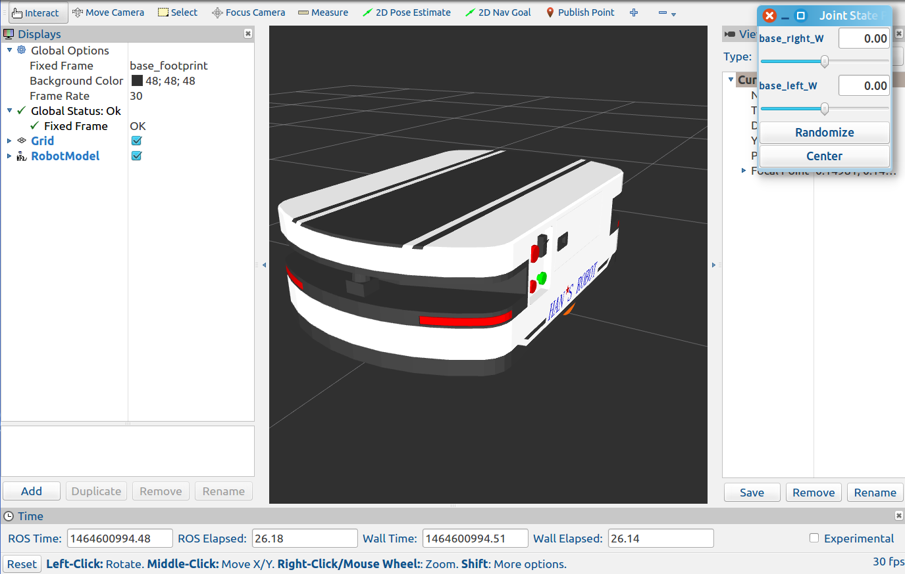

## Introduction to packages hansagv_description and hansagv_gazebo  

### URDF Model:  
launch urdf model in Rviz:  

`$ roslaunch hansagv_description hansagv_rviz.launch`  

And you should see the urdf model like so:  

 

<!---->

### Simulation in Gazebo:  
Before the simulation please install the following debs:  

`$ sudo apt-get install ros-indigo-desktop-full`  

and  

`$ sudo apt-get install ros-indigo-turtlebot ros-indigo-turtlebot-apps ros-indigo-turtlebot-interactions ros-indigo-turtlebot-simulator ros-indigo-kobuki-ftdi ros-indigo-rocon-remocon ros-indigo-rocon-qt-library ros-indigo-ar-track-alvar-msgs ros-indigo-turtlebot-apps ros-indigo-turtlebot-rviz-launchers`  

The following command starts the hansagv in the simulated world  

`$ roslaunch hansagv_gazebo hansagv_lab.launch`

#### Make the hansagv move:

`$ roslaunch turtlebot_teleop keyboard_teleop.launch`  

#### Make a map and navigate with it:

To start map building, type:  

`$ roslaunch turtlebot_gazebo gmapping_demo.launch`  

Use Rviz to visualize the map building process:  

`$ roslaunch turtlebot_rviz_launchers view_navigation.launch`  

Then use teleoperation tool to drive the AGV around the world, until you get satisfied with your map.   

Finally, save the map to disk:  

`$ rosrun map_server map_saver -f <your map name>`  

Navigate the playground:  

To be sure that all will run as expected, kill all you launched in the previous section and repeat all steps except the map building. Instead, type:  

`$ roslaunch turtlebot_gazebo amcl_demo.launch map_file:=<full path to your map YAML file>`  

The full path is for example: /home/username/catkin_ws/.../your map YAML file.